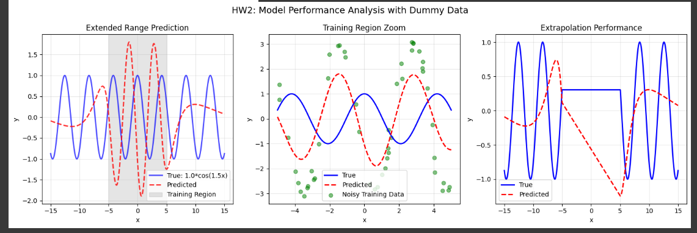
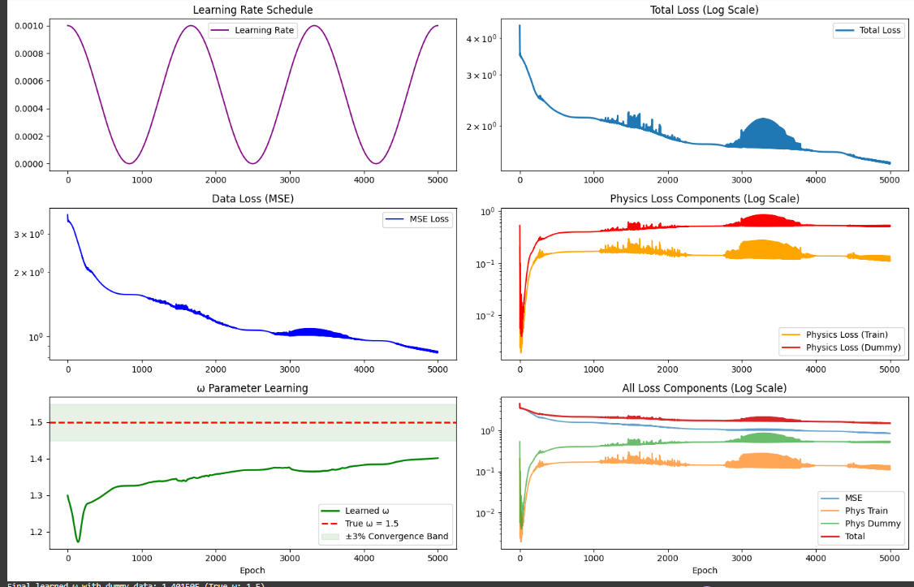

#Overview

This lab explores Physics-Informed Neural Networks (PINNs) for solving and discovering ordinary differential equations (ODEs).
The key idea is to incorporate known physical constraints into deep learning models to improve generalization, robustness, and data efficiency.

Link here : https://colab.research.google.com/drive/1r9MUMBBHu64R3DSrFCDsOfGYkh11WA8v?usp=sharing

## Task 1: ODE Solution — 
```latex
\( N[y, x] = \frac{d^2y}{dx^2} + y = 0 \)
```

### Objective  
Find \( y(x) \) that satisfies the ODE \( y'' + y = 0 \).  
We use synthetic data of the form \( y(x) = A \cos(x + \phi) \) with added noise and small sample sizes to test model robustness.  

### Steps  

#### 1. **Data Preparation**  
A synthetic dataset \( (x, y) \) was generated using:
```python
y(x) = A * cos(x + phi)
```
The dataset contained:
- Small number of points (e.g., 50)
- Randomized amplitude \( A \) and phase \( \phi \)
- Gaussian noise for robustness testing  

#### 2. **Model Preparation**  
A simple **fully-connected neural network (MLP)** was defined:
- Hidden layers: (64, 64)
- Activation: GELU  
We used:
- `vmap` for vectorized operations  
- `jacrev` for Jacobian computation  
- `hessian` for second derivatives  

This allowed us to compute:
\[
f(x), \quad \frac{df}{dx}, \quad \frac{d^2f}{dx^2}
\]

#### 3. **Black-Box Deep Learning Model**  
A standard MLP was trained on the dataset using MSE loss.  
Although it fit the training data well, **it overfit** and **failed to generalize** beyond the training range.

#### 4. **PINN Model (Physics-Informed Neural Network)**  
To regularize the learning, the physical constraint  
\[
\frac{d^2f}{dx^2} + f(x) = 0
\]
was enforced by adding a **physics-based loss** term.  
The total loss became:
\[
L = L_\text{MSE} + \lambda L_\text{physics}
\]
This approach:
- Reduced overfitting  
- Improved prediction accuracy even with noisy or sparse data  
---

## PINN Model — Second Try with Dummy Data  

Here, **dummy points \( x \)** (without known \( y \)) were added to enforce the physical law across a wider domain.

\[
L = L_\text{MSE} + \lambda_1 L_\text{phys(train)} + \lambda_2 L_\text{phys(dummy)}
\]

 **Outcome:**  
Even with only **50 noisy training points on [−5, 5]**, the model successfully predicted well outside this range — demonstrating **excellent generalization**.

---

## HW1: Adding a Periodic Constraint  

### Objective  
Since the analytical solution is periodic (\( y(x + 2\pi) = y(x) \)), we added a **periodicity loss** using dummy data:
\[
L_\text{periodic} = ||f(x + 2\pi) - f(x)||^2
\]

The total loss:
\[
L = L_\text{MSE} + \lambda_1 L_\text{physics} + \lambda_2 L_\text{periodic}
\]

### Results  
- The **periodicity loss** steadily decreased during training.  
- The model maintained correct frequency and phase behavior even far beyond the training domain.  
- The function \( f(x) \) and \( f(x + 2\pi) \) nearly overlapped, confirming **periodic consistency**.

#### Key Observations  
- Periodic constraints further improved generalization.  
- Loss curves (MSE, physics, periodic) trended down smoothly.  
- Model predictions retained cosine-like behavior outside [−5, 5].  

---

##  ODE Discovery  
### Objective  
Find \( y(x) \) satisfying:
\[
N[y, x; \omega] = \frac{d^2y}{dx^2} + \omega^2 y = 0
\]
where **ω (frequency)** is **unknown** and must be learned by the model.

### Dataset  
Generated with:
\[
y(x) = A \cos(\omega x + \phi), \quad \omega = 1.5
\]
but the model does not know ω in advance.

---

## Black-Box DL Model  
As before, a standard MLP was trained, resulting in:
- Good training fit  
- Poor generalization (overfitting observed)

---

## PINN with Learnable ω  

A **learnable parameter** ω was introduced:
```python
omega_t = torch.tensor(0.01, requires_grad=True)
```
The physics-informed loss used:
\[
L_\text{phys} = || \frac{d^2f}{dx^2} + \omega_t^2 f(x) ||^2
\]
During training, ω was updated along with network weights.

---

## HW2: PINN with Dummy Data and Learnable ω  

The model was enhanced using:
- Extra dummy data points (for enforcing physics beyond training range)
- Learnable ω initialized near the true value (1.3)

### Results Summary  
- ω converged toward **1.37**, close to the true **1.5**
- Physics losses and total loss decreased gradually  
- Generalization improved significantly  
- Predictions matched cosine patterns over the entire domain  

### Insights  
Dummy data helped enforce physical constraints globally.  
 The model learned the hidden parameter ω through gradient-based optimization.  
 Demonstrates that PINNs can **both solve and discover** differential equations from limited, noisy data.

---

##  Visualization Summary  
- **Loss Curves:** Smooth convergence for MSE, physics, and periodic losses.  
- **Prediction Plots:** Predicted and actual curves overlap closely.  
- **Periodicity Check:** \( f(x) \) ≈ \( f(x + 2\pi) \) confirms enforced periodic behavior.  
- **Frequency Discovery:** ω learned automatically through optimization.
---

## Final Remarks  

### Key Takeaways  
- **Black-box models** fail to generalize on small/noisy datasets.  
- **PINNs** enforce physical laws, improving robustness and extrapolation.  
- **Dummy data** and **periodic constraints** provide additional regularization.  
- **Learnable parameters** enable ODE discovery without prior knowledge.  

### Achievements  
Solved \( y'' + y = 0 \) using PINNs  
Enhanced generalization with physics & periodic constraints  
Discovered unknown ω in \( y'' + ω^2 y = 0 \)  
Demonstrated physically consistent deep learning  

---
**Student:** Adzembeh Joshua  

